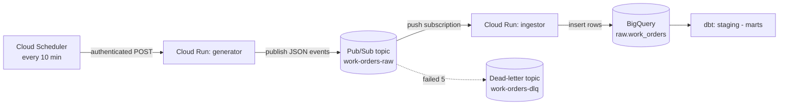

# GCP Observability-First Data Platform

All the code files for the platform build, in the folder layout the deploy
commands expect. Run the deploy commands from **this top-level folder** (the one
that contains `generator/` and `ingestor/`).

## Folder map

```
gcp-platform/
├── schema.json              # BigQuery raw.work_orders table schema (Block 3)
├── cloudbuild.yaml          # CI/CD recipe (Phase 7, stretch)
├── INCIDENT_RUNBOOK.md       # ops playbook (Phase 6)
├── generator/               # Cloud Run service: makes fake events -> Pub/Sub
│   ├── main.py
│   ├── requirements.txt
│   └── Dockerfile
├── ingestor/                # Cloud Run service: Pub/Sub -> validate -> BigQuery
│   ├── main.py
│   ├── requirements.txt
│   └── Dockerfile
├── dbt/                     # transformations (Phase 4, runs from your laptop)
│   ├── dbt_project.yml
│   ├── profiles.yml.example  # copy to ~/.dbt/profiles.yml
│   └── models/
│       ├── staging/
│       │   ├── stg_work_orders.sql
│       │   └── _sources.yml
│       └── marts/
│           └── revenue_by_shop_daily.sql
└── dags/                    # Airflow DAG (Phase 5, stretch)
    └── platform_pipeline.py
```

## Which file is used when

| File(s)                     | Used in            | How                                            |
|-----------------------------|--------------------|------------------------------------------------|
| `schema.json`               | Block 3            | `bq mk --table ... ./schema.json`              |
| `generator/`                | Block 4            | `gcloud run deploy generator --source ./generator` |
| `ingestor/`                 | Block 5            | `gcloud run deploy ingestor --source ./ingestor`   |
| `dbt/`                       | Phase 4            | `cd dbt && dbt run && dbt test`                |
| `dags/platform_pipeline.py` | Phase 5 (stretch)  | copied onto the Airflow VM                      |
| `cloudbuild.yaml`           | Phase 7 (stretch)  | run by the Cloud Build trigger on push to main |
| `INCIDENT_RUNBOOK.md`        | Phase 6            | lives in the repo; you walk it during incidents |

## dbt quick start (after rows are landing in BigQuery)

```bash
pip install dbt-bigquery
gcloud auth application-default login        # one-time local login
cp dbt/profiles.yml.example ~/.dbt/profiles.yml
cd dbt
dbt run
dbt test
```

## Data Flow
```
Cloud Scheduler          Cloud Run            Pub/Sub              Cloud Run           BigQuery
 (every 10 min)           "generator"          "work-orders-raw"    "ingestor"          "raw.work_orders"
      |                       |                     |                   |                    |
      |  1. HTTP POST (auth)  |                     |                   |                    |
      |---------------------->|                     |                   |                    |
      |                       | 2. publish 5–20     |                   |                    |
      |                       |    JSON events      |                   |                    |
      |                       |-------------------->|                   |                    |
      |                       |                     | 3. PUSH each msg  |                    |
      |                       |                     |    (auth) to URL  |                    |
      |                       |                     |------------------>|                    |
      |                       |                     |                   | 4. decode,         |
      |                       |                     |                   |    validate,       |
      |                       |                     |                   |    insert row      |
      |                       |                     |                   |------------------->|
      |                       |                     | 5. ack (204) so   |                    |
      |                       |                     |    msg is "done"  |                    |
      |                       |                     |<------------------|                    |
```




## Every component explained
 
For each service: *what it is*, *the analogy*, *why we used it*, and *the
AWS/Azure equivalent* so you can lean on what you already know.
 
### 1. Cloud Scheduler — the alarm clock
 
**What it is:** a managed cron job. You give it a schedule (`*/10 * * * *` =
"every 10 minutes") and a thing to call, and it calls that thing on time,
forever, without you running a server.
 
**Why here:** something has to *kick off* the pipeline on a rhythm. In real life
that "something" might be live user traffic; in a demo we simulate it with a
scheduler that pokes the generator.
 
**The cron string `*/10 * * * *`:** five fields = minute, hour, day-of-month,
month, day-of-week. `*/10` in the minute slot means "every 10th minute." `*`
means "every." So: every 10 minutes, every hour, every day.
 
**AWS/Azure:** AWS EventBridge Scheduler (or the old CloudWatch Events rule);
Azure Functions Timer trigger / Logic Apps recurrence.
 
### 2. Cloud Run — the serverless container runner
 
**What it is:** you hand GCP a **container** (your app packaged with everything
it needs), and Cloud Run runs it *only when a request comes in*. No request =
no running instance = **you pay nothing.** This is called **scale to zero**.
When traffic spikes, it spins up more copies automatically.
 
**Why here:** both the generator and the ingestor are small web apps. We don't
want to babysit a VM that's idle 99% of the time. Cloud Run gives us "give me a
URL, run my code when called, bill me per request."
 
**The crucial trait — it's stateless and ephemeral:** an instance can be
created and destroyed at any moment. **You cannot assume your code keeps running
after you send your HTTP response.** (Remember this sentence — it is the entire
cause of our biggest bug in Part 4.)
 
**AWS/Azure:** AWS App Runner / Fargate / Lambda (for container images);
Azure Container Apps / Container Instances.
 
### 3. Pub/Sub — the message queue in the middle
 
**What it is:** a **messaging service**. Two nouns matter:
 
- **Topic** — a named mailbox you *publish* messages into (`work-orders-raw`).
- **Subscription** — a named reader attached to a topic that *delivers* those
  messages to a consumer (`work-orders-push`).
**Publisher → Topic → Subscription → Subscriber.** One topic can have many
subscriptions (many independent readers), which is the magic: you can add a
second consumer later (say, a fraud detector) without touching the producer.
 
**Push vs pull (important):**
- **Pull:** the consumer asks "any messages for me?" and grabs them. The
  consumer is in control.
- **Push** (what we used): Pub/Sub actively sends an HTTP POST to your
  consumer's URL whenever a message arrives. The queue is in control.
We used **push** because Cloud Run is HTTP-based and scales to zero — push lets
Pub/Sub "wake it up" by calling its URL.
 
**Delivery guarantee — "at least once":** Pub/Sub promises every message is
delivered *at least* once, but **occasionally more than once** (duplicates).
This is normal and expected in distributed systems. Your consumer must therefore
be **idempotent** — processing the same message twice should be safe. (See the
interview section; this is a favorite question.)
 
**Acknowledgement (ack):** after the ingestor successfully handles a message, it
returns a success code. That tells Pub/Sub "done, don't send it again." If the
consumer returns an *error* or times out, Pub/Sub **retries** later.
 
**Dead-letter topic (`work-orders-dlq`):** if a message fails over and over
(we set the limit to 5 attempts), Pub/Sub gives up trying to deliver it and
shunts it to a separate "dead-letter" topic instead of retrying forever. It's a
quarantine for poison messages so one bad event can't clog the pipe.
 
**AWS/Azure:** AWS SNS + SQS (or EventBridge); Azure Service Bus / Event Grid.
 
### 4. BigQuery — the data warehouse
 
**What it is:** a **serverless data warehouse**. You create tables and run SQL;
GCP handles all the storage and compute behind the scenes. It's built for
analytics (scanning millions of rows), not for transactional app workloads.
 
**The three datasets — `raw`, `staging`, `marts`:** a *dataset* is just a folder
for tables. We made three on purpose, representing a layered pipeline:
 
- **raw** — data exactly as it arrived, untouched. Your source of truth.
- **staging** — cleaned and standardized (deduplicated, types fixed, lowercased).
- **marts** — business-ready aggregates (e.g., revenue per shop per day).
This raw → staging → marts pattern is an industry standard (often called
*medallion* / bronze-silver-gold). The point: **never transform data in place.**
Keep the raw copy so you can always rebuild everything downstream if you find a
bug in your logic.
 
**`raw.work_orders`:** our landing table, defined by `schema.json`. Two fields
are `REQUIRED` (`work_order_id`, `shop_id`) — BigQuery rejects rows missing
them — and the rest are `NULLABLE`. We added an `ingested_at` timestamp that the
ingestor stamps on each row, so we always know *when* a record landed.
 
**AWS/Azure:** AWS Redshift / Athena; Azure Synapse.
 
### 5. Service Accounts & IAM — identity and permissions
 
**The problem they solve:** code needs to prove *who it is* before GCP lets it do
anything. A human logs in with a password; a program logs in as a **service
account** — a non-human identity with its own email-like address
(`platform-runtime@emerald-energy-483903-f3.iam.gserviceaccount.com`).
 
**IAM (Identity and Access Management):** the rules engine that answers
*"is THIS identity allowed to do THAT action on THIS resource?"* You grant
**roles** (bundles of permissions) to identities.
 
The roles we gave `platform-runtime`:
- `roles/bigquery.dataEditor` — may write rows into BigQuery tables.
- `roles/bigquery.jobUser` — may run BigQuery jobs (an insert *is* a job).
- `roles/logging.logWriter` — may write logs.
- `roles/run.invoker` (on each service) — may *call* that Cloud Run service.
**Least privilege:** notice we did **not** give it "admin everything." Each role
is the minimum needed. If the service account key ever leaked, the blast radius
is small. This is a core security principle interviewers love.
 
**AWS/Azure:** Service account ≈ AWS IAM Role / Azure Managed Identity. IAM ≈
AWS IAM / Azure RBAC.
 
### 6. OIDC — how one machine proves its identity to another
 
When Cloud Scheduler calls the generator, or Pub/Sub pushes to the ingestor, the
*caller* must prove it's allowed. Our services are private
(`--no-allow-unauthenticated`), so anonymous calls are rejected.
 
**OIDC (OpenID Connect) token:** the caller gets a short-lived, signed "ID card"
(a token) issued for a specific audience (the target URL) and presents it with
the request. Cloud Run checks the signature and the caller's identity against
IAM. If the identity has `run.invoker`, it's let in; otherwise, 403.
 
Analogy: a one-time, time-stamped visitor badge issued to a named person for a
specific door. You can't reuse it elsewhere, and it expires fast.
 
### 7. The generator and ingestor apps
 
**Generator** (`generator/main.py`): a tiny Flask web app. On each call it
creates 5–20 random work-order events (random shop, vehicle, service, cost,
status) and publishes them as JSON to the `work-orders-raw` topic. It's our
fake "source system."
 
**Ingestor** (`ingestor/main.py`): a tiny Flask app that receives Pub/Sub pushes.
For each message it:
1. unwraps the Pub/Sub envelope and base64-decodes the data,
2. validates required fields are present,
3. stamps `ingested_at`,
4. inserts the row into `raw.work_orders`,
5. returns **204** (success) so Pub/Sub acks the message — or **500** if the
   insert fails, so Pub/Sub retries.
Notice the deliberate status codes: `204` for "handled, don't resend," `500` for
"I failed, please retry." That's how your app *talks back* to the queue.
 
---
 
## What each build step did
 
Grouped by purpose rather than line-by-line.
 
**Block 1 — Configuration.** Set shell variables (`PROJECT_ID`, `REGION`,
`RUNTIME_SA`) and pointed `gcloud` at the right project/region so we didn't have
to repeat them on every command.
 
**Block 2 — Turn the platform on + create identity.** Fresh GCP projects have
most services disabled. `gcloud services enable ...` opts in to the nine APIs we
need. Then we created the `platform-runtime` service account and granted it its
three project-level roles. *Why first?* Because every later step depends on the
APIs being on and the identity existing.
 
**Block 3 — Build the warehouse.** Created the `raw`/`staging`/`marts` datasets
in the `US` location, and the `raw.work_orders` table from `schema.json`. The
**location matters**: all datasets must share a location or cross-dataset queries
fail.
 
**Block 4 — Generator + schedule.** Created the `work-orders-raw` topic, deployed
the generator from source (Cloud Run built it into a container via Cloud Build),
granted the runtime SA permission to invoke the generator, then created the
Scheduler job that POSTs to it every 10 minutes using an OIDC token.
 
**Block 5 — Ingestor + wiring.** Created the dead-letter topic, deployed the
ingestor, granted invoke permission, then created the **push subscription** that
connects `work-orders-raw` to the ingestor's URL — with an ack deadline of 30s
and a dead-letter policy of 5 max attempts.
 
**Block 6 — Prove it.** Manually triggered the scheduler and counted rows in
BigQuery to confirm the whole chain worked end-to-end. *This is where the errors
showed up.*
 
---
## Errors and Their Solutions
 
Two things went wrong. The first was trivial; the second was the kind of subtle,
real-world bug that's worth gold in an interview because it tests whether you
understand how the cloud *actually behaves*.
 
### Error 1 — `Unexpected keyword ROWS`
 
**What you ran:**
```sql
SELECT COUNT(*) AS rows, MAX(ingested_at) AS latest FROM `...work_orders`
```
**The error:** `Syntax error: Unexpected keyword ROWS`.
 
**Why it happened:** `ROWS` is a **reserved keyword** in BigQuery's SQL dialect
(it's part of window-function syntax, e.g. `ROWS BETWEEN ...`). You can't use a
reserved word as a plain column alias — the parser sees `ROWS` and expects
window syntax, gets confused, and bails.
 
**The fix:** rename the alias to something that isn't reserved.
```sql
SELECT COUNT(*) AS row_count, MAX(ingested_at) AS latest FROM `...work_orders`
```
*(Alternatively you can wrap a reserved word in backticks, but the clean habit is
to just not name columns after keywords.)*
 
**Lesson:** every SQL engine has a list of reserved words, and they differ
slightly between engines. When a column name throws an inexplicable syntax
error, "is this a reserved word?" should be an early guess.
 
### Error 2 — The empty table mystery (the important one)
 
**The symptom:** after building everything, `raw.work_orders` had **zero rows**,
even though the generator was running and returning HTTP `200 OK` every 10
minutes. Project 2's dashboard sat on top of an empty table.
 
This is the worst kind of bug: **nothing reported an error.** Every component
said it was fine. So we had to *isolate* which link in the chain was actually
broken. Here's the exact detective process — memorize this shape, it's a
transferable skill.
 
#### Step-by-step isolation
 
The pipeline is: **Scheduler → Generator → Pub/Sub → Ingestor → BigQuery.** A
break could be at any arrow. The strategy: **test each link independently,
starting from the symptom and walking backward**, so each test rules out half
the remaining suspects.
 
1. **Confirm the symptom.** `SELECT COUNT(*)` on `raw.work_orders` → 0. And a
   `GROUP BY status` returned *no rows at all* — the tell that the table was
   truly empty, not just missing completed orders.
2. **Does the consumer side even exist?** Listed Cloud Run services and Pub/Sub
   subscriptions. Both `ingestor` and `work-orders-push` existed. → The
   *infrastructure* was built. (First hypothesis — "I skipped a step" — rejected.)
3. **Is delivery/auth failing?** Read the **ingestor's logs**. They showed only
   `Booting worker` and, later, `Handling signal: term` — **no request lines at
   all.** So the ingestor had never been called. Checked the subscription's OIDC
   config and the `run.invoker` IAM binding — both correct. Auth *config* looked
   fine, but the ingestor still wasn't being hit.
4. **The decisive test — bypass everything upstream.** We published a known-good
   message **directly to the topic** with `gcloud pubsub topics publish`, then
   watched the ingestor logs. Result: `POST 204`, and the test row **appeared in
   BigQuery.**
   This single test was the turning point. It proved the **entire back half**
   (Topic → Push → Ingestor → BigQuery) works perfectly. Whatever was broken had
   to be **before** the topic — i.e., the generator wasn't actually getting
   messages *into* the topic, even though it returned 200.
5. **Inspect the generator's own logs.** We saw the smoking gun:
```
   00:19:10  published 20 events
   00:19:10  Handling signal: term      <-- shutdown, same second
```
   The app logged "published 20 events," then the container was told to shut
   down **one second later.**
 
#### The root cause
 
This is where the "Cloud Run is ephemeral" warning from Part 2 pays off.
 
The Pub/Sub Python client's `publish()` call is **asynchronous**. It does *not*
send the message immediately. It hands the message to a **background thread**
that batches and sends messages, and returns a **future** (a placeholder for "the
result that will exist once it's actually sent"). The function returns instantly,
*before the network send happens.*
 
Our generator did this:
```python
for _ in range(n):
    publisher.publish(TOPIC, data)   # queues into background thread, returns immediately
print("published N events")          # logs (misleadingly!) before sends complete
return "ok", 200                     # HTTP response sent
```
 
Now stack that against how Cloud Run behaves:
 
1. Generator queues 20 messages into the background thread.
2. Generator returns `200`.
3. Cloud Run sees the HTTP request is finished and, since nothing else is
   happening, **scales the instance to zero — it kills the container.**
4. The background thread that was about to send those 20 messages **dies with
   the container.** The messages never leave the box.
That's why the generator reported success and published *nothing*. And it's why
the **direct CLI publish worked** — `gcloud pubsub topics publish` is
**synchronous**; it waits for the send to complete before returning.
 
**Analogy:** you hand 20 letters to an assistant to mail, shout "letters sent!",
lock the office, and go home — all in the same second. The assistant never made
it to the post office. The letters were in their hands when the lights went out.
 
#### The fix
 
Force the request to **wait until every message is truly sent** before returning.
The `publish()` future has a `.result()` method that **blocks** until the send
completes (or raises if it failed):
 
```python
@app.route("/", methods=["POST", "GET"])
def generate():
    n = random.randint(5, 20)
    futures = []
    for _ in range(n):
        future = publisher.publish(TOPIC, json.dumps(make_event()).encode("utf-8"))
        futures.append(future)
    for future in futures:
        future.result()        # <-- block until each message is actually sent
    print(json.dumps({"severity": "INFO", "message": f"published {n} events"}))
    return f"published {n} events", 200
```
 
Now the HTTP response isn't returned until the messages are confirmed sent, so
Cloud Run can't scale to zero out from under them. Redeploy, trigger, and rows
finally flow into `raw.work_orders`.
 
**Lessons (all interview-worthy):**
- "Returns 200" ≠ "did the work." Always verify the *side effect*, not the
  status code.
- Serverless containers can be killed the instant your handler returns. Finish
  all background work *before* responding.
- Async APIs hand you a future; if you don't wait on it, you've only *scheduled*
  the work, not done it.
- To debug a silent multi-stage pipeline, **test each stage in isolation** and
  use a direct injection (the manual publish) to cleave the system in half.
---
 
## Common Questions
 
Each topic: a short refresher, then questions phrased the way interviewers ask,
with answers you can adapt. Practice saying them aloud.
 
###  1. Architecture & event-driven design
 
**Q: Walk me through this project.**
> "It's a streaming ingestion pipeline on GCP. A Cloud Scheduler job triggers a
> Cloud Run service that generates work-order events and publishes them to a
> Pub/Sub topic. A push subscription delivers each message to a second Cloud Run
> service that validates it and writes it into BigQuery. Downstream, dbt models
> the raw data into staging and marts layers. The whole thing is decoupled
> through Pub/Sub, so producers and consumers scale and fail independently, and
> it's built private-by-default with a least-privilege service account."
 
**Q: Why put a queue in the middle? Why not have the generator write to BigQuery directly?**
> "Decoupling and resilience. With a queue, the producer doesn't need the
> consumer to be up — messages buffer until the consumer can handle them. It
> absorbs traffic spikes, lets me add more consumers later without touching the
> producer, and gives me retries and dead-lettering for free. Direct writes
> couple the two services: if BigQuery or the ingestor is slow, the producer
> stalls or drops data."
 
**Q: What does "loose coupling" buy you here?**
> "Each stage only depends on the contract of the stage next to it, not its
> implementation. I can redeploy the ingestor, swap BigQuery for another sink,
> or add a second subscriber, and nothing upstream changes."
 
###  2. Pub/Sub & messaging
 
**Q: Difference between a topic and a subscription?**
> "A topic is where publishers send messages. A subscription is a reader attached
> to a topic that delivers those messages to a consumer. One topic can feed many
> subscriptions, each getting its own copy of the stream."
 
**Q: Push vs pull subscriptions — which did you use and why?**
> "Push. Pub/Sub sends an HTTP POST to my consumer's URL when a message arrives.
> It fits Cloud Run, which is HTTP-based and scales to zero — push effectively
> wakes the service up. Pull is better when the consumer wants to control its own
> rate or runs as a long-lived worker."
 
**Q: What delivery guarantee does Pub/Sub give? What's the implication?**
> "At-least-once delivery — every message arrives at least once, but you can get
> duplicates. So consumers must be idempotent: processing the same message twice
> shouldn't create two rows or double-count anything."
 
**Q: How would you make the consumer idempotent?**
> "Use a stable unique key from the message — here, `work_order_id` — and
> de-duplicate on it: either an upsert/MERGE keyed on that ID, or dedup in the
> staging model with `ROW_NUMBER() OVER (PARTITION BY work_order_id ORDER BY
> updated_at DESC)` keeping the latest. My staging view actually does the latter."
 
**Q: What's a dead-letter topic and when does a message land there?**
> "It's a quarantine for messages that fail repeatedly. I set max delivery
> attempts to 5; after that, instead of retrying forever, Pub/Sub routes the
> message to the dead-letter topic so one poison message can't block the pipe. I
> can inspect and replay those separately."
 
**Q: What's the ack deadline?**
> "The time the consumer has to acknowledge a message before Pub/Sub assumes
> failure and redelivers. I set 30 seconds. Too short and you get spurious
> redeliveries; too long and genuine failures take longer to retry."
 
###  3. Cloud Run & serverless
 
**Q: What is Cloud Run and what does "scale to zero" mean?**
> "It runs containers on demand behind an HTTP endpoint. When no requests are
> coming in, it runs zero instances and costs nothing; under load it scales out
> automatically. You don't manage servers."
 
**Q: What does it mean that Cloud Run is stateless/ephemeral, and why does it matter?**
> "An instance can be created or destroyed at any time, and nothing in memory or
> on local disk survives. It matters because you can't rely on background work
> continuing after you send your HTTP response — the instance may be torn down
> the moment the request completes. I hit exactly this: my generator queued
> async Pub/Sub publishes and returned 200, Cloud Run scaled it to zero, and the
> background send thread died before the messages left. I fixed it by waiting on
> the publish futures before returning." *(This is your best story — see  7. .)*
 
**Q: What's a cold start?**
> "The extra latency when Cloud Run has to spin up a fresh instance because none
> were warm. First request after idle is slower. You can mitigate with minimum
> instances if latency matters."
 
**Q: Why deploy `--no-allow-unauthenticated`?**
> "It makes the service private — only callers with a valid token and the
> `run.invoker` role can reach it. The scheduler and Pub/Sub authenticate with
> OIDC tokens tied to my service account. Public-by-default would let anyone on
> the internet hit my endpoint."
 
###  4. Identity, IAM & security
 
**Q: What's a service account?**
> "A non-human identity for code. Instead of a username/password, my services run
> *as* a service account and inherit its IAM permissions."
 
**Q: Explain least privilege in this project.**
> "The runtime account only got what it needed: write to BigQuery, run BigQuery
> jobs, write logs, and invoke the two specific services — nothing more. No
> admin, no project owner. If the credential leaked, an attacker could write some
> rows and read nothing sensitive."
 
**Q: How does the scheduler authenticate to a private Cloud Run service?**
> "With an OIDC token. The scheduler is configured with my service account; it
> mints a short-lived signed token scoped to the target URL, and Cloud Run
> verifies it and checks the identity has `run.invoker`."
 
**Q (deeper): For BigQuery in Project 2's Metabase, how would you avoid a key file?**
> "Workload identity / Application Default Credentials when running on GCP, so no
> long-lived key exists. And scope the reader to just the reporting dataset, or
> use BigQuery authorized views, instead of a project-wide read role."
 
###  5. BigQuery & data modeling
 
**Q: Why three datasets — raw, staging, marts?**
> "Layering. Raw is the untouched source of truth, staging is cleaned and
> deduplicated, marts are business-ready aggregates. Keeping raw immutable means
> I can always rebuild downstream layers when I find a logic bug — I never lose
> the original data."
 
**Q: Why is BigQuery a good fit and when is it a bad fit?**
> "Great for analytical queries over large datasets — serverless, columnar, scales
> automatically. Bad fit for high-frequency single-row transactional updates or
> low-latency app lookups; that's what an OLTP database like Postgres is for."
 
**Q: REQUIRED vs NULLABLE columns?**
> "REQUIRED columns must be present or BigQuery rejects the row — I used that on
> `work_order_id` and `shop_id` as a basic data-quality gate at the door.
> NULLABLE allows missing values."
 
###  6. Observability & debugging
 
**Q: How do you debug a pipeline that silently produces no data?**
> "Isolate each stage. I start at the symptom and walk backward, testing one link
> at a time so each test eliminates half the suspects. The key move is injecting
> a known-good input partway through — I published a message directly to the
> topic, which proved the entire consumer half worked and pointed the blame
> upstream to the producer."
 
**Q: A service returns 200 but the work didn't happen. What now?**
> "Treat the status code as untrustworthy and verify the actual side effect — in
> my case, row counts in BigQuery. A 200 only means the handler returned; it says
> nothing about async work that may not have completed. Then check logs for the
> gap between 'I did X' and the next lifecycle event."
 
**Q: What would you add to make this production-grade observability?**
> "Structured logs (I already log JSON with severity), metrics on Pub/Sub
> backlog / undelivered messages, an uptime check and alert on the ingestor,
> a dashboard for ingestion rate and error rate, and an alert when the
> dead-letter topic gets traffic. Plus tracing to follow a single message
> end-to-end."
 
###  7. Your signature debugging story (rehearse this in STAR form)
 
> **Situation:** "After deploying the pipeline, BigQuery stayed empty even though
> the generator returned HTTP 200 on every scheduled run — no errors anywhere."
>
> **Task:** "Find why messages weren't landing, in a system where every component
> claimed to be healthy."
>
> **Action:** "I isolated the pipeline stage by stage. Cloud Run and the
> subscription existed; the ingestor logs showed it had never been called. I
> published a message directly to the topic — it landed in BigQuery, proving the
> consumer half was fine and the generator was the culprit. The generator logs
> showed 'published 20 events' followed one second later by a shutdown signal.
> The root cause was that the Pub/Sub client's `publish()` is asynchronous: it
> queues to a background thread and returns immediately. The handler returned
> 200, Cloud Run scaled the instance to zero, and the background send thread was
> killed before the messages were transmitted."
>
> **Result:** "I made the publishes synchronous by collecting the futures and
> calling `.result()` on each before returning the response. After redeploying,
> data flowed correctly. The takeaway I carry forward: on serverless, finish all
> background work before responding, and never trust a status code over the
> actual side effect."
 
This one story demonstrates: distributed-systems intuition, a disciplined
debugging method, understanding of async vs sync, and knowledge of how
serverless lifecycles actually work. It's the strongest thing in your toolkit —
lead with it.
 
---

## How it can be extended : Self hosted metabse -> Airflow Running on GCP Compute Engine

### The shape of it

```
Compute Engine VM (e2-small, us-central1)
  │
  ├── Docker + docker-compose (same pattern as your Metabase self-host)
  │     └── Airflow webserver + scheduler + Postgres (Airflow's own metadata DB)
  │
  ├── dbt project copied onto the VM
  │
  └── DAG (your existing dags/platform_pipeline.py) scheduled hourly
        dbt_run >> dbt_test
```

The VM runs Airflow in Docker, the same self-hosting pattern you already used for Metabase — so this isn't a new concept, it's the same one applied again. That consistency is also a good interview line: *"I used the same self-hosting pattern for Airflow that I used for Metabase."*

### Step by step

**1. Create the VM.** `e2-small` (2 GB RAM) — Airflow's scheduler + webserver + a small Postgres is tight on an `e2-micro` (1 GB) but comfortable on `e2-small`. I'll use `gcloud compute instances create` with a Debian/Ubuntu image, and attach the `platform-runtime` service account to it (via `--scopes` or `--service-account`) so Airflow can authenticate to BigQuery the same way your Cloud Run services do — no separate key file needed, same identity, same least-privilege pattern.

**2. Firewall rule.** Open port 8080 (Airflow's webserver) to *your IP only*, not `0.0.0.0/0` — a wide-open Airflow UI with no auth in front is a genuinely common way people get their GCP project cryptomined. I'll use `--source-ranges` scoped to your current IP.

**3. Bootstrap script (via `--metadata=startup-script`).** On first boot, the VM installs Docker, pulls down your dbt project and DAG (via `gcloud compute scp` or a small git clone), and writes a `docker-compose.yml` for Airflow — using the official `apache/airflow` image with `LocalExecutor` and a Postgres container for its metadata, mirroring your Metabase compose file almost exactly.

**4. Wire the DAG to real dbt.** Your existing `dags/platform_pipeline.py` runs `cd /opt/dbt && dbt run`. I'll adjust the path to match where dbt actually lands on the VM, and make sure the VM has `dbt-bigquery` installed and pointed at the same `profiles.yml` pattern you already have (oauth via the attached service account instead of `gcloud auth application-default login`, since there's no human logging into a VM).

**5. Schedule.** The DAG's `schedule="0 * * * *"` (hourly) is already sensible given your data lands continuously — no change needed there.

**6. Start Airflow, confirm the DAG appears, trigger it once manually, verify `staging`/`marts` tables actually update in BigQuery** — proving automation the same way we proved Project 1's pipeline: row counts before and after, not just "the command didn't error."

**7. Cost control.** Since this is a portfolio demo, not a 24/7 production system, I'll give you the `gcloud compute instances stop` / `start` commands so you can shut it down between demos and only pay for the ~10 GB disk, not compute time.

---

## Glossary
 
- **API (enabling one):** turning on a GCP service for your project before you
  can use it.
- **Ack / acknowledgement:** a consumer telling the queue "I handled this
  message, don't resend."
- **At-least-once delivery:** guarantee that messages arrive ≥1 time (possible
  duplicates).
- **Container:** your app packaged with its dependencies so it runs the same
  anywhere.
- **Cron:** time-based schedule syntax (`*/10 * * * *`).
- **Dead-letter topic:** where messages go after failing delivery too many times.
- **Future:** a placeholder object representing a result that will be ready later
  (from an async call).
- **Idempotent:** an operation that's safe to repeat — doing it twice equals
  doing it once.
- **IAM:** the permission system deciding who can do what.
- **Loose coupling:** components depend on contracts, not each other's internals.
- **OIDC token:** a short-lived signed ID card a service uses to prove who it is.
- **Push subscription:** Pub/Sub delivers messages by calling your HTTP endpoint.
- **Scale to zero:** running no instances (and paying nothing) when there's no
  traffic.
- **Service account:** an identity for code, not a person.
- **Stateless / ephemeral:** keeps nothing between requests; can be destroyed any
  time.
- **Topic / subscription:** the mailbox you publish to / the reader that delivers
  from it.

