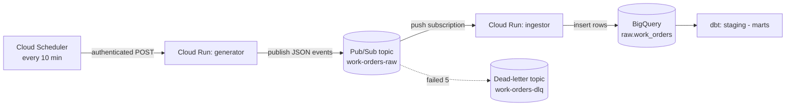

# GCP Observability-First Data Platform

All the code files for the platform build, in the folder layout the deploy
commands expect. Run the deploy commands from **this top-level folder** (the one
that contains `generator/` and `ingestor/`).

## Folder map

```
gcp-platform/
├── schema.json              # BigQuery raw.work_orders table schema (Block 3)
├── cloudbuild.yaml          # CI/CD recipe (Phase 7, stretch)
├── INCIDENT_RUNBOOK.md       # ops playbook (Phase 6)
├── generator/               # Cloud Run service: makes fake events -> Pub/Sub
│   ├── main.py
│   ├── requirements.txt
│   └── Dockerfile
├── ingestor/                # Cloud Run service: Pub/Sub -> validate -> BigQuery
│   ├── main.py
│   ├── requirements.txt
│   └── Dockerfile
├── dbt/                     # transformations (Phase 4, runs from your laptop)
│   ├── dbt_project.yml
│   ├── profiles.yml.example  # copy to ~/.dbt/profiles.yml
│   └── models/
│       ├── staging/
│       │   ├── stg_work_orders.sql
│       │   └── _sources.yml
│       └── marts/
│           └── revenue_by_shop_daily.sql
└── dags/                    # Airflow DAG (Phase 5, stretch)
    └── platform_pipeline.py
```

## Which file is used when

| File(s)                     | Used in            | How                                            |
|-----------------------------|--------------------|------------------------------------------------|
| `schema.json`               | Block 3            | `bq mk --table ... ./schema.json`              |
| `generator/`                | Block 4            | `gcloud run deploy generator --source ./generator` |
| `ingestor/`                 | Block 5            | `gcloud run deploy ingestor --source ./ingestor`   |
| `dbt/`                       | Phase 4            | `cd dbt && dbt run && dbt test`                |
| `dags/platform_pipeline.py` | Phase 5 (stretch)  | copied onto the Airflow VM                      |
| `cloudbuild.yaml`           | Phase 7 (stretch)  | run by the Cloud Build trigger on push to main |
| `INCIDENT_RUNBOOK.md`        | Phase 6            | lives in the repo; you walk it during incidents |

## dbt quick start (after rows are landing in BigQuery)

```bash
pip install dbt-bigquery
gcloud auth application-default login        # one-time local login
cp dbt/profiles.yml.example ~/.dbt/profiles.yml
cd dbt
dbt run
dbt test
```

## Data Flow
```
Cloud Scheduler          Cloud Run            Pub/Sub              Cloud Run           BigQuery
 (every 10 min)           "generator"          "work-orders-raw"    "ingestor"          "raw.work_orders"
      |                       |                     |                   |                    |
      |  1. HTTP POST (auth)  |                     |                   |                    |
      |---------------------->|                     |                   |                    |
      |                       | 2. publish 5–20     |                   |                    |
      |                       |    JSON events      |                   |                    |
      |                       |-------------------->|                   |                    |
      |                       |                     | 3. PUSH each msg  |                    |
      |                       |                     |    (auth) to URL  |                    |
      |                       |                     |------------------>|                    |
      |                       |                     |                   | 4. decode,         |
      |                       |                     |                   |    validate,       |
      |                       |                     |                   |    insert row      |
      |                       |                     |                   |------------------->|
      |                       |                     | 5. ack (204) so   |                    |
      |                       |                     |    msg is "done"  |                    |
      |                       |                     |<------------------|                    |
```




## Every component explained
 
For each service: *what it is*, *the analogy*, *why we used it*, and *the
AWS/Azure equivalent* so you can lean on what you already know.
 
### 1. Cloud Scheduler — the alarm clock
 
**What it is:** a managed cron job. You give it a schedule (`*/10 * * * *` =
"every 10 minutes") and a thing to call, and it calls that thing on time,
forever, without you running a server.
 
**Why here:** something has to *kick off* the pipeline on a rhythm. In real life
that "something" might be live user traffic; in a demo we simulate it with a
scheduler that pokes the generator.
 
**The cron string `*/10 * * * *`:** five fields = minute, hour, day-of-month,
month, day-of-week. `*/10` in the minute slot means "every 10th minute." `*`
means "every." So: every 10 minutes, every hour, every day.
 
**AWS/Azure:** AWS EventBridge Scheduler (or the old CloudWatch Events rule);
Azure Functions Timer trigger / Logic Apps recurrence.
 
### 2. Cloud Run — the serverless container runner
 
**What it is:** you hand GCP a **container** (your app packaged with everything
it needs), and Cloud Run runs it *only when a request comes in*. No request =
no running instance = **you pay nothing.** This is called **scale to zero**.
When traffic spikes, it spins up more copies automatically.
 
**Why here:** both the generator and the ingestor are small web apps. We don't
want to babysit a VM that's idle 99% of the time. Cloud Run gives us "give me a
URL, run my code when called, bill me per request."
 
**The crucial trait — it's stateless and ephemeral:** an instance can be
created and destroyed at any moment. **You cannot assume your code keeps running
after you send your HTTP response.** (Remember this sentence — it is the entire
cause of our biggest bug in Part 4.)
 
**AWS/Azure:** AWS App Runner / Fargate / Lambda (for container images);
Azure Container Apps / Container Instances.
 
### 3. Pub/Sub — the message queue in the middle
 
**What it is:** a **messaging service**. Two nouns matter:
 
- **Topic** — a named mailbox you *publish* messages into (`work-orders-raw`).
- **Subscription** — a named reader attached to a topic that *delivers* those
  messages to a consumer (`work-orders-push`).
**Publisher → Topic → Subscription → Subscriber.** One topic can have many
subscriptions (many independent readers), which is the magic: you can add a
second consumer later (say, a fraud detector) without touching the producer.
 
**Push vs pull (important):**
- **Pull:** the consumer asks "any messages for me?" and grabs them. The
  consumer is in control.
- **Push** (what we used): Pub/Sub actively sends an HTTP POST to your
  consumer's URL whenever a message arrives. The queue is in control.
We used **push** because Cloud Run is HTTP-based and scales to zero — push lets
Pub/Sub "wake it up" by calling its URL.
 
**Delivery guarantee — "at least once":** Pub/Sub promises every message is
delivered *at least* once, but **occasionally more than once** (duplicates).
This is normal and expected in distributed systems. Your consumer must therefore
be **idempotent** — processing the same message twice should be safe. (See the
interview section; this is a favorite question.)
 
**Acknowledgement (ack):** after the ingestor successfully handles a message, it
returns a success code. That tells Pub/Sub "done, don't send it again." If the
consumer returns an *error* or times out, Pub/Sub **retries** later.
 
**Dead-letter topic (`work-orders-dlq`):** if a message fails over and over
(we set the limit to 5 attempts), Pub/Sub gives up trying to deliver it and
shunts it to a separate "dead-letter" topic instead of retrying forever. It's a
quarantine for poison messages so one bad event can't clog the pipe.
 
**AWS/Azure:** AWS SNS + SQS (or EventBridge); Azure Service Bus / Event Grid.
 
### 4. BigQuery — the data warehouse
 
**What it is:** a **serverless data warehouse**. You create tables and run SQL;
GCP handles all the storage and compute behind the scenes. It's built for
analytics (scanning millions of rows), not for transactional app workloads.
 
**The three datasets — `raw`, `staging`, `marts`:** a *dataset* is just a folder
for tables. We made three on purpose, representing a layered pipeline:
 
- **raw** — data exactly as it arrived, untouched. Your source of truth.
- **staging** — cleaned and standardized (deduplicated, types fixed, lowercased).
- **marts** — business-ready aggregates (e.g., revenue per shop per day).
This raw → staging → marts pattern is an industry standard (often called
*medallion* / bronze-silver-gold). The point: **never transform data in place.**
Keep the raw copy so you can always rebuild everything downstream if you find a
bug in your logic.
 
**`raw.work_orders`:** our landing table, defined by `schema.json`. Two fields
are `REQUIRED` (`work_order_id`, `shop_id`) — BigQuery rejects rows missing
them — and the rest are `NULLABLE`. We added an `ingested_at` timestamp that the
ingestor stamps on each row, so we always know *when* a record landed.
 
**AWS/Azure:** AWS Redshift / Athena; Azure Synapse.
 
### 5. Service Accounts & IAM — identity and permissions
 
**The problem they solve:** code needs to prove *who it is* before GCP lets it do
anything. A human logs in with a password; a program logs in as a **service
account** — a non-human identity with its own email-like address
(`platform-runtime@emerald-energy-483903-f3.iam.gserviceaccount.com`).
 
**IAM (Identity and Access Management):** the rules engine that answers
*"is THIS identity allowed to do THAT action on THIS resource?"* You grant
**roles** (bundles of permissions) to identities.
 
The roles we gave `platform-runtime`:
- `roles/bigquery.dataEditor` — may write rows into BigQuery tables.
- `roles/bigquery.jobUser` — may run BigQuery jobs (an insert *is* a job).
- `roles/logging.logWriter` — may write logs.
- `roles/run.invoker` (on each service) — may *call* that Cloud Run service.
**Least privilege:** notice we did **not** give it "admin everything." Each role
is the minimum needed. If the service account key ever leaked, the blast radius
is small. This is a core security principle interviewers love.
 
**AWS/Azure:** Service account ≈ AWS IAM Role / Azure Managed Identity. IAM ≈
AWS IAM / Azure RBAC.
 
### 6. OIDC — how one machine proves its identity to another
 
When Cloud Scheduler calls the generator, or Pub/Sub pushes to the ingestor, the
*caller* must prove it's allowed. Our services are private
(`--no-allow-unauthenticated`), so anonymous calls are rejected.
 
**OIDC (OpenID Connect) token:** the caller gets a short-lived, signed "ID card"
(a token) issued for a specific audience (the target URL) and presents it with
the request. Cloud Run checks the signature and the caller's identity against
IAM. If the identity has `run.invoker`, it's let in; otherwise, 403.
 
Analogy: a one-time, time-stamped visitor badge issued to a named person for a
specific door. You can't reuse it elsewhere, and it expires fast.
 
### 7. The generator and ingestor apps
 
**Generator** (`generator/main.py`): a tiny Flask web app. On each call it
creates 5–20 random work-order events (random shop, vehicle, service, cost,
status) and publishes them as JSON to the `work-orders-raw` topic. It's our
fake "source system."
 
**Ingestor** (`ingestor/main.py`): a tiny Flask app that receives Pub/Sub pushes.
For each message it:
1. unwraps the Pub/Sub envelope and base64-decodes the data,
2. validates required fields are present,
3. stamps `ingested_at`,
4. inserts the row into `raw.work_orders`,
5. returns **204** (success) so Pub/Sub acks the message — or **500** if the
   insert fails, so Pub/Sub retries.
Notice the deliberate status codes: `204` for "handled, don't resend," `500` for
"I failed, please retry." That's how your app *talks back* to the queue.
 
---
 
## What each build step did
 
Grouped by purpose rather than line-by-line.
 
**Block 1 — Configuration.** Set shell variables (`PROJECT_ID`, `REGION`,
`RUNTIME_SA`) and pointed `gcloud` at the right project/region so we didn't have
to repeat them on every command.
 
**Block 2 — Turn the platform on + create identity.** Fresh GCP projects have
most services disabled. `gcloud services enable ...` opts in to the nine APIs we
need. Then we created the `platform-runtime` service account and granted it its
three project-level roles. *Why first?* Because every later step depends on the
APIs being on and the identity existing.
 
**Block 3 — Build the warehouse.** Created the `raw`/`staging`/`marts` datasets
in the `US` location, and the `raw.work_orders` table from `schema.json`. The
**location matters**: all datasets must share a location or cross-dataset queries
fail.
 
**Block 4 — Generator + schedule.** Created the `work-orders-raw` topic, deployed
the generator from source (Cloud Run built it into a container via Cloud Build),
granted the runtime SA permission to invoke the generator, then created the
Scheduler job that POSTs to it every 10 minutes using an OIDC token.
 
**Block 5 — Ingestor + wiring.** Created the dead-letter topic, deployed the
ingestor, granted invoke permission, then created the **push subscription** that
connects `work-orders-raw` to the ingestor's URL — with an ack deadline of 30s
and a dead-letter policy of 5 max attempts.
 
**Block 6 — Prove it.** Manually triggered the scheduler and counted rows in
BigQuery to confirm the whole chain worked end-to-end. *This is where the errors
showed up.*
 
---
